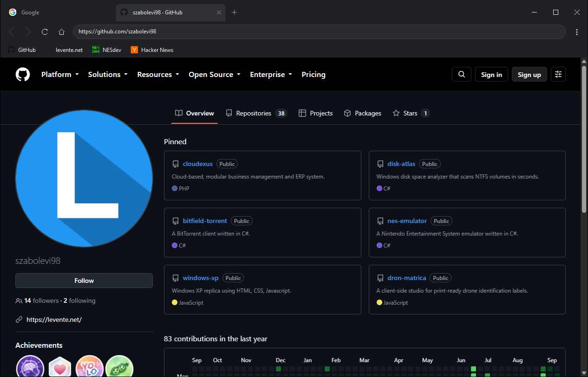

# Chromium Browser

A portable web browser on the Chromium engine, written in C#. Unpack it
anywhere, run it, and it keeps its history, bookmarks, settings and cookies in a
folder beside itself. Nothing is installed, and nothing is written to the
registry — copy the folder to a memory stick and it is the same browser, with
the same tabs, on the next machine.



Two tabs — GitHub in front, Google behind it — with the bookmarks bar under the
address bar. The window's chrome is painted by this project: the tab strip, the
toolbar and the window buttons are drawn, not assembled from system controls.

## What it does

- **Tabs** that drag to reorder, close with the middle button, shrink as they
  multiply and scroll once they cannot shrink further, each with the site's own
  icon.
- **One bar for addresses and searches.** Anything that is not an address is
  searched for, with Google, DuckDuckGo, Bing, Startpage, Wikipedia, or an
  address of your own.
- **Bookmarks**, on a bar that fits as many as the window is wide and puts the
  rest behind a chevron, renameable and removable where they sit.
- **History and downloads** as pages of the browser's own — `browser://history`
  and `browser://downloads` — searchable, clearable, and drawn in the window's
  colours rather than in white.
- **Find on a page** with Ctrl+F: a bar in the chrome, Enter and F3 to walk the
  matches, and a count that climbs as the engine works through the page.
- **Private windows** with their own cookies and cache, held in memory and gone
  when the window closes. Nothing reaches the history or the download list, and
  a badge in the toolbar means one is never mistaken for an ordinary window.
- **Session restore**: the windows and tabs that were open come back, each
  window where it sat and the tab that was in front still in front.
- **One copy per set of data.** A second launch hands its address to the browser
  already running instead of starting a rival over the same files — while a copy
  on a memory stick stays a browser of its own, with its own profile.
- **Light and dark**, following Windows or pinned to either, using the desktop's
  own accent colour.
- **Five languages** — English, Hungarian, German, French and Spanish — switched
  in the settings and applied without a restart.
- **The keyboard a browser is expected to answer**: Ctrl+T, Ctrl+W, Ctrl+N,
  Ctrl+Shift+N, Ctrl+Tab, Ctrl+L, Ctrl+D, Ctrl+H, Ctrl+J, Ctrl+F, F3, Ctrl+P,
  the zoom keys and F5 — including while a page has the focus.

## Portable, precisely

Everything the browser remembers goes in `Data\` beside the executable:
bookmarks, history, downloads and settings as readable JSON, and Chromium's own
cache and cookies in a folder of their own. The user profile is used only when
the folder the program sits in cannot be written to — an installation under
`Program Files`, or a read-only stick.

The about box says which of the two it ended up with, and where.

## Building

Needs the .NET 9 SDK.

```
dotnet build ChromiumBrowser.sln
dotnet run --project tests/ChromiumBrowser.Tests    # 90 offline checks
dotnet run --project tests/ChromiumBrowser.UiTests  # 87 user interface checks
```

The user interface checks drive the controls the way a pointer would, without
showing a window: they click tabs, drag one past its neighbour, open the menu
and click an entry in it. `tools/screenshot.ps1` captures the running window on
its own, which is how the picture above was taken, and `tools/make-app-icon.ps1`
draws the icon at every size Windows asks for.

## Layout

```
src/ChromiumBrowser           the Windows Forms application
src/ChromiumBrowser.Core      profile, layout arithmetic and the data behind the
                              browser — no user interface dependencies
tests/ChromiumBrowser.Tests   offline checks
tests/ChromiumBrowser.UiTests checks that drive the controls
tools/                        the screenshot and icon tools
```

## Notes

### The window keeps its frame

The title bar is drawn by this project, but the window is not built out of
panels: it keeps a real frame and takes back only the caption band, in
`WM_NCCALCSIZE`. That is what keeps the snap layouts, the drop shadow, the
minimise animation and Windows 11's rounded corners — all the things a
home-made title bar usually loses.

### A menu cannot be thrown away during its own click

Windows Forms closes a drop-down before it dispatches the click, so disposing
the menu when it closes takes the click with it and the entry does nothing.
Deferring the disposal is worse: an entry that opens a dialog runs a message
loop of its own, the deferred disposal runs inside it, and the click returns to
a menu that is gone — which crashes outright. So the window keeps one menu for
its whole life and fills it again each time it opens.

### A private window needs to be told about the browser's own pages

Its cookies and cache live in a request context of its own, and a scheme handler
belongs to the context that registered it rather than to the program. Until that
context was told about `browser://` as well, a private window answered its own
settings page with "unknown scheme".

### The page holds the keyboard the way a window does

The page is the engine's own window, so asking a text box beside it to take the
focus leaves the typing going into the page. The engine has to be told to let go
first — which is what the find bar does when it opens, and undoes when it
closes.

## The 2020 version

This is a rewrite from an empty folder, not a modernisation: the 2020 browser
that used to live here shared the name and nothing else. It is kept on the
[`2020_variant`](https://github.com/szabolevi98/chromium-browser/tree/2020_variant)
branch and as [release v1.0.1](https://github.com/szabolevi98/chromium-browser/releases/tag/v1.0.1),
with a built binary, as an archive. It is not safe to browse with: the CefSharp
it was built on is years out of date and carries known Chromium advisories.

What it did — several tabs, a search box, bookmarks with a manager, a home page
that could be changed, a download handler and a Hungarian/English switch — was
the floor this version had to clear, not the target.

## License

MIT. See [LICENSE](LICENSE).
